# Project Frankenstein's Dashboard

**Two event sources. One assessment pipeline. A live operational view.**

A polyglot security-monitoring demo that connects an ASP.NET Core log API and a PowerShell event simulator to a Python analytics bridge and an interactive JavaScript command center. Original events remain inspectable, AI assessments are advisory, and delivery failures are handled explicitly.

| Component                                 | Responsibility                                         | Stack                                  | Local address / output               |
| ----------------------------------------- | ------------------------------------------------------ | -------------------------------------- | ------------------------------------ |
| [TheLegacyCore](#thelegacycore)           | Serve a repeatable legacy log snapshot                 | ASP.NET Core / .NET 8                  | `http://localhost:5195/api/raw-logs` |
| [TheChaosMonkey](#thechaosmonkey)         | Generate synthetic security events                     | PowerShell                             | Append-only JSON Lines file          |
| [TheAnalyticsBridge](#theanalyticsbridge) | Ingest, assess, retain, and stream events              | Python 3.12 / FastAPI / LangChain      | `http://127.0.0.1:58081`             |
| [TheCommandCenter](#thecommandcenter)     | Present live risk, event details, and origin locations | JavaScript / Vite / ECharts / Three.js | `http://127.0.0.1:5173`              |

The addresses above match the examples below, not hard-coded backend defaults. The bridge port comes from configuration; Vite proxies to port `58081` unless `BRIDGE_URL` is set.

## System at a Glance

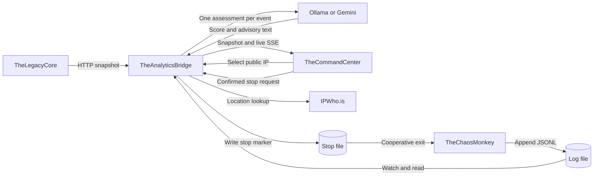

**First run:** prepare the bridge environment in section 3, start the legacy API, start the simulator, start the bridge, then open the command center. Use a separate terminal for each long-running process. Local Ollama also needs its server running. Every run-command block below states its working directory; root-relative commands assume a fresh terminal at the repository root.

**Demo boundary:** the simulator writes fictional events; it does not perform attacks. This project is not a production SIEM, an intrusion-prevention system, or proof that a displayed IP is malicious. State is bounded and in memory, the API is unauthenticated, and there is no durable delivery guarantee.

---

<a id="thelegacycore"></a>

<details>
<summary><strong>1. TheLegacyCore</strong></summary>

<details>
<summary><strong>Overview</strong></summary>

### A Small, Deliberately Stable Upstream System

The legacy service exposes three representative operational records: a successful login, a failed SSH connection, and a denied file-access attempt. It supplies the HTTP ingestion path without requiring an external system or database.

Its job ends at returning raw logs. It does not score risk, normalize records for the dashboard, stream changes, or implement mitigation. Keeping these responsibilities in the bridge demonstrates how an existing API can participate without being rewritten.

| Input               | Output                      | State                                    |
| ------------------- | --------------------------- | ---------------------------------------- |
| `GET /api/raw-logs` | JSON array of three records | Snapshot created once at process startup |

Entry point: [LegacyLogger.cs](TheLegacyCore/TheLegacyCore/TheLegacyCore/LegacyLogger.cs). Target framework: [TheLegacyCore.csproj](TheLegacyCore/TheLegacyCore/TheLegacyCore/TheLegacyCore.csproj).

</details>

<details>
<summary><strong>Setup &amp; Run</strong></summary>

### Prerequisite

Install the **.NET 8 SDK**. The SDK, rather than only the runtime, is required to build and run the project from source.

### Start the Service

From the repository root:

```powershell
dotnet run --project ./TheLegacyCore/TheLegacyCore/TheLegacyCore/TheLegacyCore.csproj --launch-profile http
```

The HTTP profile binds to `http://localhost:5195`. Use this profile for the documented bridge configuration; HTTPS is not necessary for the local demo. The alternative HTTPS profile includes port `7085` and requires the usual local development certificate setup.

### Verify the Response

In another terminal:

```powershell
Invoke-RestMethod http://localhost:5195/api/raw-logs
```

Expect three records. Repeating the request returns the same snapshot, including the same timestamps, until the service restarts. Stop the service with **Ctrl+C**.

Build without starting a server, from the repository root:

```powershell
dotnet build ./TheLegacyCore/TheLegacyCore/TheLegacyCore/TheLegacyCore.csproj
```

**Troubleshooting:** if port `5195` is occupied, change the HTTP profile in [launchSettings.json](TheLegacyCore/TheLegacyCore/TheLegacyCore/Properties/launchSettings.json) and update `LEGACYCORE_ENDPOINT` in the bridge configuration to match. The bridge retries when the service is unavailable; the simulator ingestion path can continue independently.

</details>

<details>
<summary><strong>Architecture &amp; Technical Deep Dive</strong></summary>

### Request Lifecycle

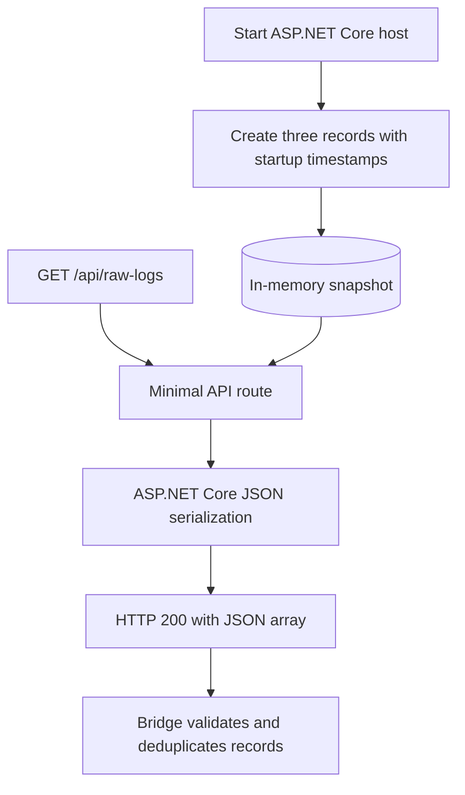

`WebApplication.CreateBuilder()` creates the host, and `MapGet()` registers the single endpoint. The route captures the startup array, so request handling does not regenerate events. ASP.NET Core serializes the anonymous records using camelCase JSON property names.

### Source Contract

Illustrative record; timestamp values depend on when and where the service starts:

```json
{
  "timestamp": "2026-09-12T14:30:00+05:30",
  "source": "45.33.22.11",
  "event": "SSH Connection",
  "status": "Failed"
}
```

| Field       | Meaning                                     | Bridge expectation                                |
| ----------- | ------------------------------------------- | ------------------------------------------------- |
| `timestamp` | Source-local event time, serialized by .NET | Parseable timestamp; preserve the supplied offset |
| `source`    | Source IP address                           | Valid IP address                                  |
| `event`     | Human-readable activity                     | Nonblank string                                   |
| `status`    | Activity outcome                            | Nonblank string                                   |

### Why a Stable Snapshot Matters

The bridge polls repeatedly but deduplicates using all four fields. Fixed timestamps ensure that repeated requests do not create artificial new events. Restarting the legacy service creates new timestamps, making those records new to a running bridge.

There is no upstream event ID, cursor, pagination, or change feed. Consequently, two genuinely different events with identical fields cannot be distinguished. The bridge's deduplication cache also resets on restart and can evict older entries. This is useful demo behavior, not exactly-once processing.

### Ownership and Limits

The service owns only source records and HTTP serialization. Authentication, durable storage, real log collection, and business-specific event generation are outside this implementation. Its HTTP contract is exercised by the bridge's mocked-transport ingestion tests; there is no separate .NET unit-test project.

</details>

</details>

---

<a id="thechaosmonkey"></a>

<details>
<summary><strong>2. TheChaosMonkey</strong></summary>

<details>
<summary><strong>Overview</strong></summary>

### A Controllable Source of Synthetic Events

The simulator appends fictional security events to a local JSON Lines file. It creates a continuously changing source for the dashboard and provides a visible, reversible target for the **Mitigate** control.

The four event labels are `Brute Force`, `SQL Injection`, `Port Scan`, and `Credential Stuffing`. These are labels only: the script does not probe networks, send attack traffic, or authenticate against any target.

| Input                            | Output                         | Control                        |
| -------------------------------- | ------------------------------ | ------------------------------ |
| Optional log and stop-file paths | One UTF-8 JSON object per line | Ctrl+C or a shared stop marker |

Implementation: [AttackSim.ps1](TheChaosMonkey/AttackSim.ps1).

</details>

<details>
<summary><strong>Setup &amp; Run</strong></summary>

### Prerequisites

Use Windows PowerShell or PowerShell 7. The default startup path also requires **Pipenv and the configured bridge environment**, because the simulator asks the bridge's configuration module for the stop-file location. Complete the bridge setup first, even if its HTTP server is not yet running.

### Start with Shared Configuration

From the repository root:

```powershell
$env:PIPENV_DONT_LOAD_ENV = '1'
./TheChaosMonkey/AttackSim.ps1
```

By default, logs are appended to `live_stream.log` inside `TheChaosMonkey`. Configure the bridge's `ATTACK_LOG_PATH` to read that same file and `ATTACK_SIM_STOP_PATH` to identify the marker the simulator checks.

### Run Independently of the Python Loader

From the repository root, an explicit stop path avoids the Pipenv lookup:

```powershell
./TheChaosMonkey/AttackSim.ps1 -LogPath ./TheChaosMonkey/live_stream.log -StopPath ./TheChaosMonkey/AttackSim.stop
```

Explicit relative paths resolve from the terminal's working directory. The bridge resolves its relative paths from `TheAnalyticsBridge`, so the equivalent bridge setting is `../TheChaosMonkey/AttackSim.stop`. Absolute paths are preferable when coordinating separately launched processes. Parent directories must already exist.

> **Use a dedicated stop file.** The script deletes an existing stop marker at startup. Never set `StopPath` to the log file or any valuable file, and add custom marker paths to your Git ignore rules.

### Stop and Restart

Use **Mitigate** in the dashboard, press **Ctrl+C** in the simulator terminal, or request a cooperative stop from the API:

```powershell
Invoke-RestMethod -Method Post http://127.0.0.1:58081/api/simulator/stop
```

The API returns `stop_requested` after writing the marker. Run the script again to resume generation; startup clears the previous marker and preserves existing log history.

If script execution is blocked, follow your machine's approved PowerShell execution policy. If default startup cannot resolve the marker, check bridge dependency installation, `APP_ENV`, and `ATTACK_SIM_STOP_PATH`, or use the explicit-path command above.

</details>

<details>
<summary><strong>Architecture &amp; Technical Deep Dive</strong></summary>

### Generation and Stop Flow

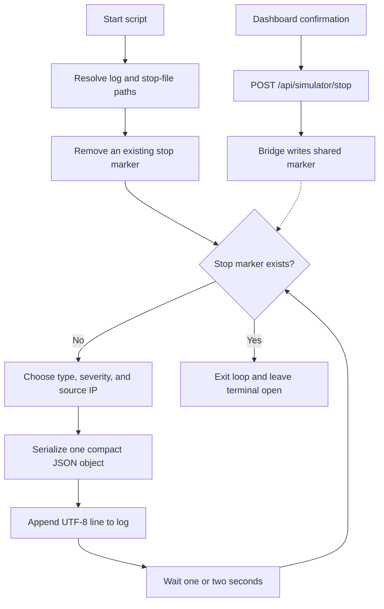

### Generated Record

```json
{
  "time": "14:30:00",
  "type": "Brute Force",
  "severity": 8,
  "origin": "103.25.12.45"
}
```

| Field      | Generation rule                       | Interpretation                                  |
| ---------- | ------------------------------------- | ----------------------------------------------- |
| `time`     | Current local time as `HH:mm:ss`      | No date or timezone is supplied                 |
| `type`     | Random choice of four labels          | Fictional event category                        |
| `severity` | Integer from 1 through 9              | `Get-Random -Maximum 10` excludes 10            |
| `origin`   | `103.25.12.1` through `103.25.12.254` | Synthetic attribution, not an observed attacker |

The script uses `ConvertTo-Json -Compress` and appends a platform newline using UTF-8 without a byte-order mark. Each line is independently parseable. JSON object field order is not significant. The bridge waits for a complete newline before consuming a record, so a partial write is not mistaken for a malformed complete event.

The one-to-two-second delay follows each write. It is not a precise event-rate scheduler: filesystem and process scheduling add latency. Repeated identical lines are still separate simulator events, unlike repeated records in the legacy API snapshot.

### Cooperative Mitigation, Not Process Termination

The API accepts no PID, shell command, or caller-selected path. It invokes an injected `SimulatorControl`, which creates the configured marker off the Python event loop. The script checks that marker at the top of its next iteration.

This deliberately avoids killing a process by name or terminating a shared terminal. A request during an iteration may permit one final write before the loop exits. HTTP `202` confirms the marker was written, not that a simulator was running or that exit has been observed.

Run one simulator per stop path. Both processes must share the same filesystem location and compatible permissions: the bridge writes the marker, while the simulator reads and deletes it. A stop request made before startup is not a persistent disable switch, because startup clears stale markers.

### Retention and Verification

The log is append-only and survives simulator restarts. Stopping generation does not stop the legacy poller, watcher, bridge, or queued AI work, so new dashboard entries may still arrive afterward. Do not truncate or replace the log while the watcher is running; stop the bridge first.

Backend tests verify idempotent stop requests, filesystem errors, and real PowerShell stopping/restarting against temporary paths. The script integration test is skipped when PowerShell is unavailable. Tests do not target the workspace's running simulator.

</details>

</details>

---

<a id="theanalyticsbridge"></a>

<details>
<summary><strong>3. TheAnalyticsBridge</strong></summary>

<details>
<summary><strong>Overview</strong></summary>

### The Integration and Assessment Layer

The bridge converts two different ingestion mechanisms into one processed-event feed. It validates source data, applies backpressure, requests one AI assessment per event, retains recent history, and streams updates to every connected dashboard.

An assessment contains a **danger score from 1 to 100**, **two observations**, and **two suggested responses**. If scoring fails, the original event is retained with unavailable AI fields and processing continues without a retry or invented score.

| Responsibility         | Implementation                                              |
| ---------------------- | ----------------------------------------------------------- |
| HTTP ingestion         | Async HTTPX poller with bounded deduplication               |
| File ingestion         | Watchdog notifications and incremental JSONL reads          |
| AI assessment          | LangChain with local Ollama or Google Gemini                |
| Retention and delivery | Bounded in-memory history and independent SSE subscriptions |
| Operator controls      | Cooperative simulator stop and on-demand IP geolocation     |
| Hosting                | FastAPI/Uvicorn; optionally serves the built dashboard      |

Runtime composition: [main.py](TheAnalyticsBridge/main.py). HTTP contracts: [api/routes.py](TheAnalyticsBridge/api/routes.py).

</details>

<details>
<summary><strong>Setup &amp; Run</strong></summary>

### 1. Install Locked Dependencies

Install **Python 3.12** and **Pipenv**, then run from the repository root:

```powershell
Set-Location ./TheAnalyticsBridge
pipenv sync
```

All remaining bridge commands in this section run from `TheAnalyticsBridge` unless stated otherwise. Use the committed lockfile for repeatable installation.

### 2. Configure the Environment

Create a local `.env` inside `TheAnalyticsBridge`, or update only the necessary settings in an existing one. The following is a complete local-Ollama example; it contains no secret:

```dotenv
LEGACYCORE_ENDPOINT=http://localhost:5195/api/raw-logs
LEGACY_POLL_INTERVAL_SECONDS=2
LEGACY_REQUEST_TIMEOUT_SECONDS=5
LEGACY_DEDUP_CAPACITY=10000

ATTACK_LOG_PATH=../TheChaosMonkey/live_stream.log
ATTACK_WATCH_RETRY_SECONDS=2
ATTACK_SIM_STOP_PATH=../TheChaosMonkey/AttackSim.stop

EVENT_QUEUE_CAPACITY=1000
EVENT_STORE_CAPACITY=1000
SSE_QUEUE_CAPACITY=100

LLM_MODEL_TYPE=local
LLM_MODEL=llama3

API_HOST=127.0.0.1
API_PORT=58081
```

| Setting                          | Purpose                                                               |
| -------------------------------- | --------------------------------------------------------------------- |
| `LEGACYCORE_ENDPOINT`            | Full upstream log URL                                                 |
| `LEGACY_POLL_INTERVAL_SECONDS`   | Delay after each poll attempt                                         |
| `LEGACY_REQUEST_TIMEOUT_SECONDS` | HTTPX timeout setting for legacy requests, not an LLM deadline        |
| `LEGACY_DEDUP_CAPACITY`          | Maximum remembered legacy record identities                           |
| `ATTACK_LOG_PATH`                | Append-only simulator input file                                      |
| `ATTACK_WATCH_RETRY_SECONDS`     | Reconciliation/retry interval; notifications can trigger reads sooner |
| `ATTACK_SIM_STOP_PATH`           | Dedicated marker shared with PowerShell                               |
| `EVENT_QUEUE_CAPACITY`           | Maximum unprocessed queued records                                    |
| `EVENT_STORE_CAPACITY`           | Maximum retained processed records                                    |
| `SSE_QUEUE_CAPACITY`             | Maximum queued outgoing records per client                            |
| `LLM_MODEL_TYPE`                 | Required provider selection: `local` or `gemini`                      |
| `LLM_MODEL`                      | Model name available to the chosen provider                           |
| `API_HOST`, `API_PORT`           | HTTP listen interface and port                                        |

Capacities must be positive integers; poll, watcher, and legacy timeout intervals must be positive finite values. Relative log and marker paths resolve from the bridge directory, not the launching shell. The log and marker parent directories must exist.

### 3. Prepare a Model Provider

**Local Ollama:** install Ollama and download the configured model:

```powershell
ollama pull llama3
```

Keep the Ollama server running, normally at `http://localhost:11434`. If the desktop application or service is not already serving it, run `ollama serve` in a separate terminal. The Ollama client honors `OLLAMA_HOST` for a different server. Local mode does not require a Google API key and never falls back to Gemini automatically.

**Google Gemini:** instead set the following provider values and provision `GOOGLE_API_KEY` privately in the selected environment or a secret manager:

```dotenv
LLM_MODEL_TYPE=gemini
LLM_MODEL=gemini-2.5-flash
```

Use a model available to your key and account. Never commit credentials or put them in frontend configuration. Gemini receives the original log fields, including IPs, and replayed records can incur additional usage costs. Local mode sends those fields to the configured Ollama server. Use only data approved for that destination.

### 4. Start the Bridge

After starting the legacy service and simulator in their own terminals:

```powershell
$env:PIPENV_DONT_LOAD_ENV = '1'
pipenv run python main.py
```

With the example configuration, interactive API documentation is at **http://127.0.0.1:58081/docs**. Verify from another terminal:

```powershell
Invoke-RestMethod http://127.0.0.1:58081/api/health
Invoke-RestMethod http://127.0.0.1:58081/api/events
curl.exe -N http://127.0.0.1:58081/api/stream
```

An empty initial history is valid. Events become visible after their assessment attempt finishes, not immediately on ingestion. Stop a streaming `curl` command or the bridge with **Ctrl+C** in its own terminal.

### Environment Selection and Overrides

| Shell `APP_ENV`                | Loaded file      |
| ------------------------------ | ---------------- |
| Unset, `development`, or `dev` | `.env`           |
| `production` or `prod`         | `.env-prod` only |
| Any other value                | Startup error    |

The application loads configuration explicitly with `override=False`, preserving deployment-provided values. Pipenv can preload `.env` before Python runs, so set `PIPENV_DONT_LOAD_ENV=1` when using production selection or shell overrides. The application's own loader still runs.

For a production-selected configuration, provision every required setting before starting:

```powershell
$env:APP_ENV = 'production'
$env:PIPENV_DONT_LOAD_ENV = '1'
pipenv run python main.py
```

This selects configuration; it does **not** add production hardening. Set `APP_ENV` before launch, not solely inside the file it selects. There is no development-file fallback. Restart after changing providers or startup settings, and launch the simulator with the same environment selection and marker overrides.

### Tests and Diagnostics

From `TheAnalyticsBridge`:

```powershell
pipenv run python -m unittest discover -s tests -v
```

The suite focuses on business behavior: input validation, deduplication, complete-line handling, backpressure, retained unscored events, subscriber isolation, API delivery, mitigation, and geolocation privacy. It includes useful integration tests with temporary files, real watchdog notifications, ephemeral local HTTP servers, and temporary simulator paths. HTTP provider traffic and model responses are mocked; no live LLM calls are made.

Standalone reader commands print accepted logs for diagnosis and bypass shared scoring/storage. Run only the reader you need, not a second bridge alongside the active one:

```powershell
pipenv run python -m ingestion.legacy_api_poller
pipenv run python -m ingestion.attack_log_watcher
```

These are alternative long-running commands, not a sequence in one terminal. Stop each with Ctrl+C.

### Troubleshooting

| Symptom                                      | Check                                                                                                         |
| -------------------------------------------- | ------------------------------------------------------------------------------------------------------------- |
| Port bind failure                            | Choose a free `API_PORT`, then match Vite's `BRIDGE_URL`; Windows may reserve ports such as `8000`            |
| Legacy events absent                         | Confirm the HTTP launch profile, endpoint, and whether the three records were already ingested                |
| File events absent                           | Match `ATTACK_LOG_PATH`; check directory access and newline-terminated JSON                                   |
| Events visible without AI                    | Check provider availability and structured-output compatibility; failures retain the log                      |
| Connected stream but no new processed events | A model request may be pending indefinitely; health does not measure progress                                 |
| API returns `503` after a worker failure     | Inspect server logs, correct the fault, and restart; ingestion retries do not recover a fatal runtime failure |
| Root dashboard route absent                  | Build the frontend, then restart the bridge to register static routes                                         |
| Geolocation unavailable                      | Check outbound HTTPS and system certificate trust; never disable TLS verification                             |

</details>

<details>
<summary><strong>Architecture &amp; Technical Deep Dive</strong></summary>

### 1. Composition and Ownership

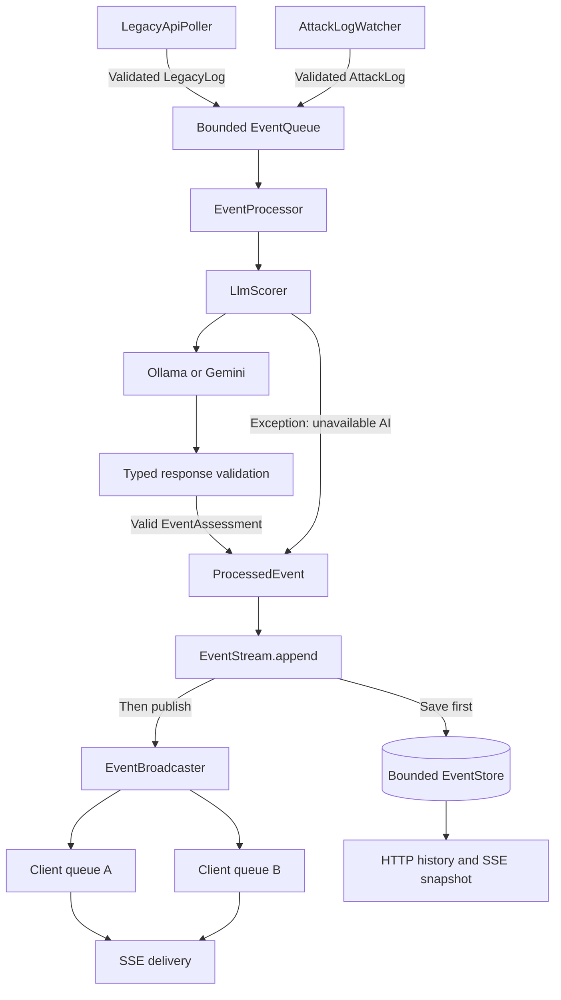

The FastAPI lifespan owns a single runtime. `bridge_runtime()` composes the queue, store, broadcaster, scorer, and readers, then starts the two readers and processor in an `asyncio.TaskGroup`. The shared HTTP client has the same lifetime. Shutdown closes subscribers, cancels workers, closes the client, and joins the filesystem observer.

| Package / module              | Owns                                                      | Deliberately does not own           |
| ----------------------------- | --------------------------------------------------------- | ----------------------------------- |
| `configuration`               | Environment selection and shared path resolution          | Runtime processing                  |
| `models`                      | Immutable source and processed-event contracts            | HTTP or model clients               |
| `ingestion`                   | Polling, file cursor, validation, delivery to a handler   | Scoring and browser delivery        |
| `messaging`                   | Bounded queues, subscriptions, store/publish coordination | HTTP transport or AI prompts        |
| `processing`                  | One assessment attempt and one write per consumed event   | Concrete queue, provider, or API    |
| `integrations/llm`            | Provider selection, prompt, structured response parsing   | Storage and dashboard policy        |
| `integrations/simulator`      | Cooperative stop-file request                             | Process killing                     |
| `integrations/geolocation.py` | Validated public-IP lookup and cache                      | Event scoring                       |
| `storage`                     | Bounded recent history                                    | Durability or cross-process sharing |
| `api`                         | HTTP/SSE transport and runtime availability               | Source ingestion algorithms         |

The processor depends on narrow protocols: `EventSource` exposes `get()` and `task_done()`, `EventScorer` exposes `name` and async `score()`, and `EventWriter` exposes `append()`. History consumers use `EventReader.snapshot()`. Matching methods satisfy these contracts without requiring concrete inheritance.

`EventStream` is injected as the processor's writer. It coordinates storage and publication without introducing an HTTP dependency into processing. Separate reader/writer and publisher/subscription contracts keep each consumer's interface small. This is dependency inversion around actual change points, rather than one abstraction per class.

### 2. Ingestion and Backpressure

**Legacy HTTP path.** The poller requests the configured snapshot immediately, validates each record independently, and skips invalid records without blocking valid ones. It remembers the complete four-field identity only after downstream acceptance succeeds. An HTTP, JSON, or handler failure is retried on the next polling cycle. Its bounded least-recently-used deduplication cache is process-local; eviction or restart permits replay.

**Simulator file path.** Watchdog filters relevant notifications and wakes the async reader using a thread-safe event-loop callback. File reads run off the event loop. The reader processes up to 100 complete UTF-8 lines per batch and drains further batches in order. It supports initial file creation, a UTF-8 BOM, and multibyte characters split across writes. Invalid completed lines are skipped; incomplete lines wait for more bytes and a newline.

The file cursor advances only after downstream acceptance or intentional rejection of an invalid complete line. If acceptance fails, the next read retries the unaccepted record without rereading previously accepted records. Periodic reconciliation allows recovery even when no new filesystem notification arrives. The supported contract is append-only: rotation, truncation, and replacement are not implemented.

**Shared queue.** Both readers await the same bounded `put()` callback. When full, producers wait rather than discard accepted input. This bounds queued records, not the on-disk log, network snapshot size, or external source retention. Reader acceptance means admission to the queue, not successful scoring or durable persistence.

### 3. AI Assessment and Failure Semantics

The scoring chain is:

```text
ILog.to_payload()
    -> ChatPromptTemplate
    -> selected chat model
    -> PydanticOutputParser(DangerScoreResponse)
    -> immutable EventAssessment
```

Both source formats serialize through `ILog.to_payload()`, so downstream logic does not require dataclass introspection. The prompt treats the log as untrusted data and asks for evidence-grounded observations and proportionate, advisory recommendations about that single event. It does not claim to correlate historical activity.

| Output             | Validation                                                      |
| ------------------ | --------------------------------------------------------------- |
| `danger_score`     | Strict integer 1-100; booleans and numeric strings are rejected |
| `insight`          | Exactly two nonblank strings, each at most 400 characters       |
| `respondsuggested` | Exactly two nonblank strings, each at most 400 characters       |
| Additional fields  | Rejected                                                        |

The key `respondsuggested` is the implemented API field name and is preserved throughout the pipeline. One request produces all three fields; opening the event inspector does not make another model call. Ollama receives the response JSON schema; both providers' output is checked by the same parser. Markdown-fenced JSON is supported by the parser. Structural validity does not establish factual accuracy or prompt-injection resistance.

Both providers use temperature zero. Gemini is configured with `max_retries=0`; the installed SDK interprets that as one attempt. Ollama makes one request. There is no automatic cloud fallback, regex-derived score, or failed-event requeue.

**There is no LLM deadline.** Gemini uses `timeout=None`, and Ollama retains its disabled client timeout. A pending request can block sequential processing indefinitely and eventually fill the queue. `LLM_REQUEST_TIMEOUT_SECONDS` is not read. The legacy HTTP timeout, geolocation timeout, and SSE send timeout are separate policies, not an assessment deadline.

The processor catches exceptions from the scoring call only. It then saves the original event with null score, `scoring_method="unavailable"`, and empty AI arrays, and proceeds to the next event. Invalid internal event construction and storage failures still propagate. Cancellation is not swallowed. `task_done()` runs in `finally`, so queue `join()` indicates completed work attempts, not guaranteed successful storage.

### 4. Processed-Event Contract

Illustrative successful API record:

```json
{
  "event_id": "d0bd02de-d38a-4c32-aedd-edda6aa006ea",
  "log": {
    "time": "14:30:00",
    "type": "Brute Force",
    "severity": 8,
    "origin": "103.25.12.45"
  },
  "danger_score": 80,
  "scoring_method": "llm",
  "processed_at": "2026-09-12T09:00:01+00:00",
  "insight": [
    "The source labels this event as a brute-force attempt.",
    "Source severity is 8; this record alone does not confirm compromise."
  ],
  "respondsuggested": [
    "Review related authentication records.",
    "Verify the affected account and source context."
  ]
}
```

`event_id` is a new processed UUID, not an upstream identity. `processed_at` is UTC processing time; the nested source timestamp remains unchanged. Simulator times remain date-free rather than acquiring an invented event date. History preserves source field names; browser normalization creates the unified presentation.

On assessment failure, the same record envelope and original `log` survive with `danger_score: null`, `scoring_method: "unavailable"`, `insight: []`, and `respondsuggested: []`. Null is unavailable, not zero. Unscored records cannot contain AI insights. Older scored records may have empty assessment arrays; the UI handles them without fabricating text.

### 5. HTTP Surface

| Method and route               | Successful response                     | Failure / operational meaning                                            |
| ------------------------------ | --------------------------------------- | ------------------------------------------------------------------------ |
| `GET /api/events`              | Retained JSON array, oldest first       | `503` when processing runtime is unavailable                             |
| `GET /api/stream`              | Named SSE `snapshot`, then `log` events | `503` if unavailable; `reset` when a subscription closes                 |
| `GET /api/health`              | `200`, `{"status":"ok"}`                | Runtime availability only; not model connectivity or processing progress |
| `GET /api/locations/{address}` | Location, `non_public`, or `unknown`    | `422` for invalid IP; `503` for provider/response errors                 |
| `POST /api/simulator/stop`     | `202`, `{"status":"stop_requested"}`    | `503` on marker-write failure; GET is not supported                      |
| `GET /docs`                    | Interactive OpenAPI documentation       | API exploration, not a dashboard                                         |

### 6. Snapshot-to-Live Consistency

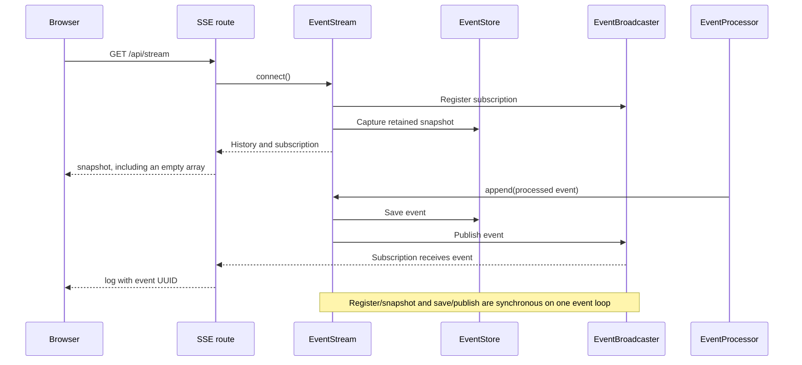

Subscription registration and snapshot capture contain no `await`, as do save and publish. Within this single-event-loop design, an arriving event is either in the captured history or queued for live delivery, preventing a gap at the handoff. All production writes must pass through `EventStream`; direct store writes would bypass broadcasting.

An initial `snapshot` contains an array, even when empty. A `log` contains one processed event and uses its UUID as the SSE ID. A `reset` carries `{"reason":"resync_required"}`. Clients must listen to named events, not only `onmessage`, and replace local history on every snapshot.

Each subscriber owns a bounded outgoing queue. Clients do not compete for events. Overflow closes and removes the slow subscription without blocking scoring or healthy subscribers; the server attempts to send `reset` before ending the stream. Reconnection always receives a replacement snapshot. `Last-Event-ID` is deliberately ignored: this is not durable incremental replay.

The transport sends heartbeat comments every 15 seconds and limits a socket send to 30 seconds. SSE retry metadata specifies 2,000 milliseconds. Reverse proxies must preserve streaming, avoid response buffering, and allow long-lived connections. Per-client bounds do not limit the total number of clients.

### 7. Geolocation Is an Independent, On-Demand Path

Selecting an IP calls the location endpoint; ingestion and scoring do not perform location lookups. The bridge validates the address, handles private/reserved/multicast addresses locally, and sends only a selected public IP to a fixed IPWho.is HTTPS endpoint. It never sends event contents to that provider.

Responses use validated finite coordinates within latitude/longitude ranges. Unknown results have no coordinates. A process-local cache holds up to 1,000 results for one hour; an async lock serializes cache misses and avoids duplicate concurrent lookups. Network operations have an eight-second timeout and use system certificate trust with TLS verification enabled.

This path is independent of the event-processing worker, but serialized cache misses can delay one another. Internet access is needed for public-IP cache misses. Check the [provider documentation](https://ipwhois.io/documentation) for current quotas and terms before deployment. Locations may represent VPN, proxy, or cloud infrastructure, not a person or the actual origin of an attack.

### 8. Retention, Shutdown, and Production Limits

| Boundary         | Current guarantee                                                    | Not guaranteed                                |
| ---------------- | -------------------------------------------------------------------- | --------------------------------------------- |
| Ingestion queue  | Bounded FIFO admission with producer backpressure                    | Durable acceptance                            |
| Recent store     | Latest configured number of records; detached oldest-first snapshots | Database persistence                          |
| Subscriber queue | Independent bounded fan-out per connected client                     | Recovery of evicted records                   |
| Scoring failure  | Original event survives a failed assessment attempt                  | Recovery from a permanently pending request   |
| Restart          | Available upstream data can be read again                            | Stable processed IDs or exactly-once delivery |
| Shutdown         | Worker cancellation and resource cleanup                             | Queue draining or in-flight event persistence |

The process uses one Uvicorn worker. Multiple workers would duplicate readers and fragment queues, history, and subscriptions. Synchronous store and stream operations are intended for one event loop, not external threads.

A fatal worker exception cancels siblings and closes the feed. History, stream, and health then return `503`, even if the HTTP server remains listening. Simulator stop remains available independently. Ordinary LLM failures are not fatal under the policy above. Graceful HTTP shutdown allows five seconds before remaining requests are cancelled and lifespan cleanup runs.

Before exposing the service beyond a trusted local environment, add authentication and authorization, TLS, endpoint rate limits, durable ingestion/storage, progress monitoring, and a deliberate model deadline/recovery policy. Protect geolocation quota and mitigation access. The current API enables neither authentication nor cross-origin browser access; use the development proxy or single-origin build arrangement described below.

</details>

</details>

---

<a id="thecommandcenter"></a>

<details>
<summary><strong>4. TheCommandCenter</strong></summary>

<details>
<summary><strong>Overview</strong></summary>

### An Event-First Operational Workspace

The command center turns the bridge feed into a unified event table, current threat gauge, activity charts, AI detail inspector, and interactive origin map. The interface prioritizes event review rather than exposing ingestion-system wiring to the operator.

| Workflow                | Result                                                                |
| ----------------------- | --------------------------------------------------------------------- |
| Review the live feed    | Newest-first events, search, risk filters, and pagination             |
| Inspect an event        | Preserved source details, AI score, two insights, and two suggestions |
| Understand current risk | Five-minute peak-risk gauge with explicit unknown states              |
| Investigate an origin   | Unique-IP directory and selectable approximate globe location         |
| Preserve a working view | Pause display updates; export matching records to CSV                 |
| Mitigate the simulation | Confirm and request a cooperative simulator stop                      |

The frontend uses vanilla JavaScript with Vite, ECharts, Three.js, and Lucide. Typography is bundled through Fontsource. Production event data is never fabricated by the application, and visual assets do not require runtime CDN loading.

</details>

<details>
<summary><strong>Setup &amp; Run</strong></summary>

### Development

Use **Node.js 22.12+**; Node 24 is also supported. From the repository root:

```powershell
Set-Location ./TheCommandCenter
npm ci
npm run dev
```

Open the URL printed by Vite, normally **http://127.0.0.1:5173**. If that port is occupied, use the actual URL Vite prints. Start the bridge and event sources for live data; an empty or disconnected state is not replaced with sample events.

Vite proxies `/api` to `http://127.0.0.1:58081`. To use a different bridge port, run from `TheCommandCenter` before starting Vite:

```powershell
$env:BRIDGE_URL = 'http://127.0.0.1:58082'
npm run dev
```

`BRIDGE_URL` configures the development proxy, not model access and not the built browser bundle. No model credentials belong in frontend code or environment files.

### Single-Origin Build

From `TheCommandCenter`, build before starting or restarting the bridge:

```powershell
npm run build
Set-Location ../TheAnalyticsBridge
$env:PIPENV_DONT_LOAD_ENV = '1'
pipenv run python main.py
```

Open **http://127.0.0.1:58081/** with the example bridge configuration. FastAPI serves the generated dashboard at `/`, bundled resources at `/assets`, and the globe texture at `/earth.jpg`. API routes remain under `/api` and Swagger remains at `/docs`.

Static routes are registered only when the built output exists at application creation. Restart an existing bridge instead of launching a duplicate on the same data. This single-origin setup needs no separate Vite server, but it still has the local-demo security limits described above.

### Checks

From `TheCommandCenter`:

```powershell
npm test
npm run build
```

Node tests cover deterministic normalization, risk calculations, unknown states, history replacement, filtering, CSV escaping, and geographic math. They require neither a running bridge nor a model. The production build checks module bundling; large chart/globe chunk warnings are advisory, not proof of a failed build.

For a manual end-to-end check, confirm that events arrive, severity 8/9 yields critical risk, event details show assessment text or a clear unavailable state, public-IP selection focuses the globe, and mitigation stops new simulator writes while pending processing can continue.

### Troubleshooting

| Symptom                                 | Check                                                                         |
| --------------------------------------- | ----------------------------------------------------------------------------- |
| Reconnect warning                       | Bridge process, configured port, and Vite proxy target                        |
| Data remains after disconnection        | Expected: retained browser data remains visible until replacement or reload   |
| No new rows while paused                | Resume or use Latest events; ingestion continues in the background            |
| Gauge is N/A                            | Recent records exist but none has a known risk                                |
| No map marker                           | Selected address may be non-public, unknown, or unavailable from the provider |
| Globe unavailable                       | Check WebGL support; textual location information remains usable              |
| Mitigate accepted but rows still arrive | Stop is cooperative and queued events or legacy processing can continue       |

</details>

<details>
<summary><strong>Architecture &amp; Technical Deep Dive</strong></summary>

### 1. Data-to-View Flow

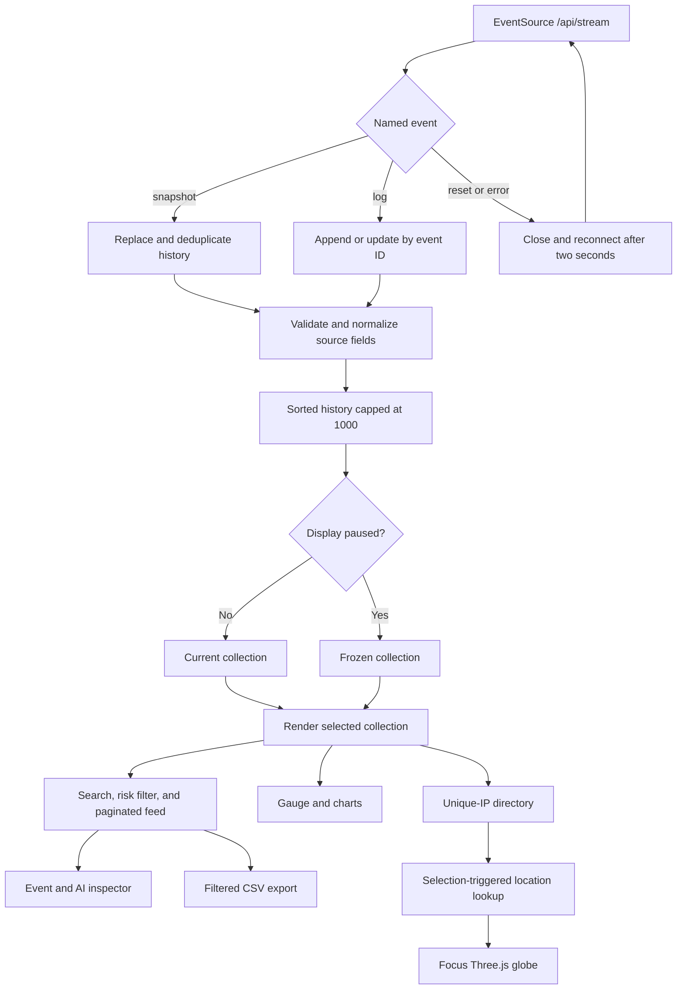

### 2. Module Responsibilities

| Module                                                  | Responsibility                                                              |
| ------------------------------------------------------- | --------------------------------------------------------------------------- |
| [src/events.js](TheCommandCenter/src/events.js)         | Pure normalization, retention, risk, filtering, timeline, and CSV functions |
| [src/app.js](TheCommandCenter/src/app.js)               | SSE lifecycle, display state, DOM rendering, charts, inspector, mitigation  |
| [src/app.css](TheCommandCenter/src/app.css)             | Responsive layout, visual hierarchy, and accessibility states               |
| [src/origin-map.js](TheCommandCenter/src/origin-map.js) | IP directory, selection, request cancellation, and location state           |
| [src/geography.js](TheCommandCenter/src/geography.js)   | Unique-origin aggregation and coordinate conversion                         |
| [src/globe.js](TheCommandCenter/src/globe.js)           | Textured Earth, marker, camera focus, orbit controls, and cleanup           |
| [vite.config.js](TheCommandCenter/vite.config.js)       | Loopback development server, API proxy, and chart/globe chunks              |

Pure event transformations are separate from DOM orchestration, making business rules testable without a browser. Rendering is coalesced with animation frames; clocks and time-sensitive summaries update independently of new event delivery.

### 3. Stream Reconciliation and Display State

The app listens for `snapshot`, `log`, and `reset`. A snapshot replaces retained history rather than merging with stale browser records. Normalization rejects malformed event identities, processing timestamps, scores, and simulator severities. Malformed AI arrays are cleared without hiding an otherwise valid source record.

Records are deduplicated by processed UUID, sorted by processing time, and capped at 1,000. A live event with an existing UUID replaces that entry. The table reverses retained order to show newest first, including when delivery arrives out of timestamp order. Reconnect snapshots can remove records that the bridge has already evicted.

On reset or error, the application closes the old `EventSource` and explicitly retries after two seconds. Existing data stays visible with connection status. This is necessary even when an initial non-200 connection response would not yield the desired native retry behavior. A connected stream proves transport availability, not source activity or healthy model progress.

Pause freezes the displayed collection while the incoming collection continues to update. Resume returns to the newest page. Latest events also exits an older/paused view without clearing search or risk filters. Search and risk filtering apply to CSV export across all matching pages, not just the ten visible rows. The origin directory uses the displayed collection independently of table filters.

### 4. Risk Is Derived, Not a Second AI Score

The original `danger_score` remains visible separately from the browser's risk classification:

| Event state                       | Derived event risk                      |
| --------------------------------- | --------------------------------------- |
| Legacy record with AI score       | AI score                                |
| Legacy record without AI score    | Unknown (`null`)                        |
| Simulator record with AI score    | Maximum of AI score and `severity * 10` |
| Simulator record without AI score | `severity * 10`                         |

The global gauge uses the maximum known event risk processed within the last five minutes, excluding future timestamps. It does not average risk, estimate compromise probability, or use the source's undated simulator time to construct a historical window.

| Range / state              | Presentation                                                   |
| -------------------------- | -------------------------------------------------------------- |
| 0-29                       | Low                                                            |
| 30-59                      | Elevated                                                       |
| 60-79                      | High                                                           |
| 80-100                     | Critical, red gauge                                            |
| Recent records all unknown | N/A, neutral state; not represented as low risk                |
| Mixed known and unknown    | Peak known risk plus unknown-coverage disclosure               |
| No recent records          | Zero with a no-recent-signals explanation; not proof of safety |

Source severity 8 or 9 therefore triggers critical risk even when the AI estimate is lower or unavailable. Five-minute summaries age out without requiring another event. Charts use processing timestamps and UTC labels; the activity timeline groups retained records into twelve one-minute buckets. A bucket without a known risk contributes zero to that chart and should not be interpreted as a positive safety assessment.

### 5. AI Inspector and Safe Presentation

The event drawer reads the assessment already attached to the record. It displays exactly two observations and two suggested responses when available. Missing or invalid arrays produce an unavailable state; they never trigger a second model call or automated remediation.

Model/source text is escaped rather than rendered as trusted HTML. The inspector and exported presentation use unified customer-facing fields, while the backend retains source-specific log structure. Copied JSON preserves null AI scores and assessment arrays. CSV quotes cells, doubles embedded quotes, neutralizes formula-prefixed values, and leaves unavailable scores empty.

### 6. Origin Directory and Globe

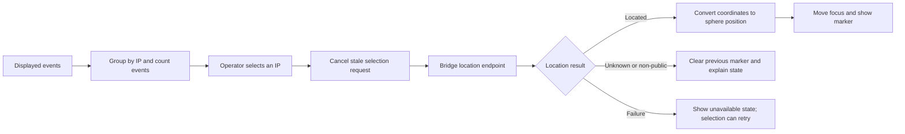

Geography logic deduplicates IPs and aggregates event counts and peak known risk. Requests happen only on selection, use a twelve-second browser timeout, and cancel stale requests so a slower earlier selection cannot overwrite the current one. Errors and unknown results clear the previous marker instead of leaving a misleading location behind.

Latitude and longitude map to a unit sphere with axes aligned to the Earth texture. Three.js handles the textured globe, highlighted location, smooth focus, and OrbitControls rotation/zoom. Reset restores the view. Rendering respects hidden-page pausing and reduced-motion preferences; WebGL failure leaves textual location feedback available.

The list and globe reflect actual available coordinates. Simulator IPs may cluster geographically, and the UI does not invent distribution for visual effect. Public-IP lookups leave the machine through the bridge only after selection, subject to the privacy and accuracy caveats in section 3.

### 7. Mitigation and Deployment Boundaries

Mitigate requires confirmation before posting to the stop endpoint. Success means request acceptance, not observed exit; failures remain visible rather than silently presenting success. The action never executes model suggestions, changes firewall rules, or stops the analytics service.

During development, the Vite proxy keeps browser requests same-origin. In the built arrangement, FastAPI serves both assets and `/api`. There are no frontend secrets or runtime CDN dependencies, but live events require the bridge and cache-miss geolocation requires outbound internet access. A static bundle alone is not an offline event-processing system.

### Assets and Attribution

The bundled Earth texture originates from the [Three.js Earth atmosphere example asset](https://threejs.org/examples/textures/planets/earth_atmos_2048.jpg). Icons use [Lucide](https://lucide.dev/). Space Grotesk and IBM Plex fonts are packaged through [Fontsource](https://fontsource.org/). Respect the upstream licenses supplied with these dependencies and assets when redistributing them.

</details>

</details>

---

## Application Screenshots

Captured from the running local application using its demo event feed. Select any image to view it at full resolution.

### Dashboard

An event-first workspace combining retained signals, searchable activity, the five-minute threat gauge, and supporting analytics.

[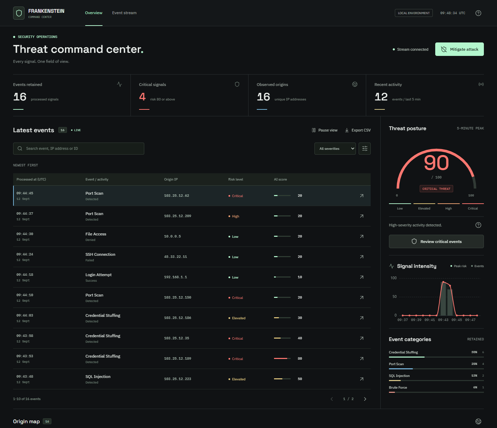](docs/screenshots/dashboard.png)

### Interactive 3D IP Map

Selecting an address in the origin directory focuses the textured globe on its approximate network location, with coordinates and event counts kept in context.

[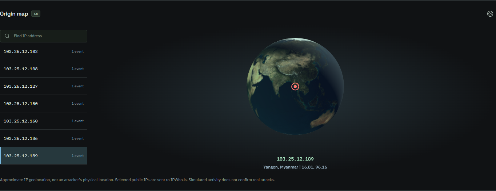](docs/screenshots/ip-3d-map.png)

_Locations describe approximate network infrastructure. Synthetic event addresses do not identify confirmed attackers._

### AI Insight

The event inspector brings together two AI observations, two suggested responses, the original AI score, and the derived risk score. Recommendations are advisory and never execute automatically.

<a href="docs/screenshots/ai-insight.png">
  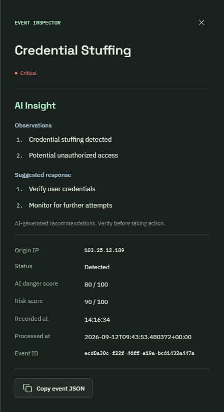
</a>

_Scores and recommendations shown here are captured model output, not independently verified findings._

---

## Live Demo

**54 seconds | 1440 x 1080 | MP4 | No audio**

Watch real simulator events arrive through the analytics bridge, inspect an event's AI assessment, and explore its approximate network location on the interactive globe. The recording uses the running application without injected events or fabricated assessments; only the initial page load was trimmed.

[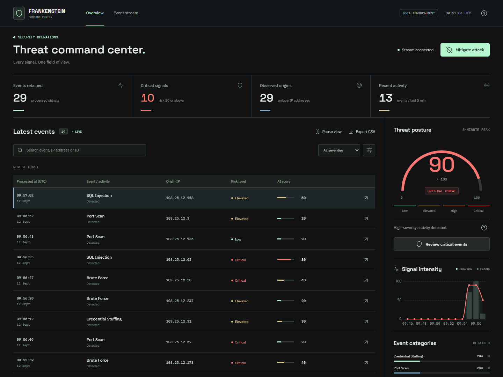](docs/demo/frankenstein-demo.mp4)

**[Watch or download the demo](docs/demo/frankenstein-demo.mp4)**

| Time  | What to watch                                                    |
| ----- | ---------------------------------------------------------------- |
| 00:00 | Live event feed, new incoming logs, and the current threat gauge |
| 00:21 | AI observations, suggested responses, and event-level scores     |
| 00:30 | Public-IP selection, location lookup, and 3D globe rotation      |
| 00:48 | Return to the live dashboard while processing continues          |

The simulator remains running throughout; mitigation is not activated. IP locations are approximate, and AI recommendations remain advisory. Depending on your README viewer, the video link may open a file page or require downloading the MP4 rather than playing inline.
